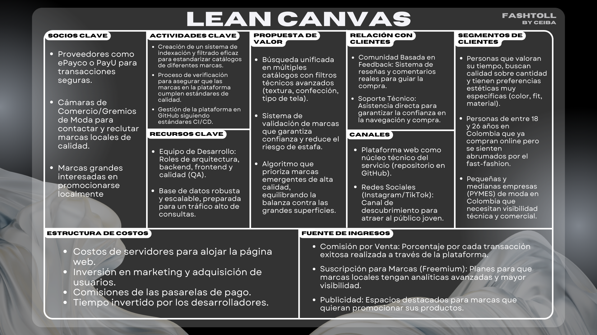

# Fashtoll by CEIBA

  

> **Fashtoll** es el ecosistema digital diseñado para conectar el talento de la moda local con el consumidor consciente. Actuamos como un puente inteligente que elimina la fatiga de decisión y potencia la visibilidad de marcas emergentes mediante tecnología de búsqueda avanzada.

---
## Índice
- **[Descripción del Problema](#-descripción-del-problema)** 
- **[Propuesta de Valor](#%EF%B8%8F-propuesta-de-valor)** 
- **[Lean Canvas](#-lean-canvas)** 
- **[Misión y Visión](#-misión-y-visión)** 
- **[Equipo](#-equipo)** 
- **[Referencias](#-referencias)** 

---
## 🔍 Descripción del Problema
En un ecosistema donde el **38.1% de las ventas de ropa ya son digitales** [1], el proceso de compra se ha vuelto paradójicamente ineficiente. Los usuarios se enfrentan a un mercado fragmentado donde la búsqueda de prendas específicas es una tarea tediosa y frustrante.

### El Desafío del Consumidor
* **Fatiga de Decisión:** El **84% de los compradores** reporta que los filtros de búsqueda actuales son ineficaces o innecesariamente complejos [2], lo que convierte una búsqueda simple en una pérdida de tiempo.
* **Brecha de Confianza:** El **66% de los usuarios** prefiere marcas establecidas no por gusto, sino por el miedo a la falta de garantías en marcas de nicho [1].

### El Desafío de la Marca Local
* **Barreras de Entrada:** Las marcas emergentes deben invertir hasta un **20% de sus ingresos** solo en visibilidad [2], con un costo de adquisición de cliente (CAC) que promedia los **$129 USD** [2]. 

Fashtoll nace para resolver esta ineficiencia, transformando el caos de la oferta en una experiencia de usuario dirigida y confiable.

---
## 🎖️ Propuesta de Valor
Fashtoll no es solo un catálogo; es un **optimizador de mercado** que redefine la relación entre el cliente y la moda independiente.

1. **Búsqueda Técnica Estandarizada:** Implementamos un sistema de indexación que permite filtrar por características reales (material, fit, estilo) en múltiples catálogos simultáneamente.
2. **Validación y Confianza:** Actuamos como un sello de garantía para marcas locales, reduciendo el riesgo percibido y permitiendo que la calidad compita de igual a igual con el *fast fashion*.
3. **Eficiencia en el Descubrimiento:** Reducimos drásticamente el tiempo de búsqueda para el usuario y el costo de marketing para la marca, sirviendo como el intermediario técnico que el sector moda en Colombia necesita.

*A diferencia de los portales masivos, nosotros priorizamos la **identidad local** y la **precisión técnica** de la búsqueda.*

---
## 📒 Lean Canvas

  

---
## 🎯 Misión y Visión

### Misión
Impulsar la transformación digital del sector moda en Colombia, facilitando el acceso a alternativas sostenibles y locales. Con un mercado nacional que moviliza **$33 billones de pesos anuales** [3], nuestra misión es capturar y potenciar ese **9% de penetración e-commerce** [3] actual, empezando por Bogotá —el epicentro del gasto en moda— para conectar a las marcas con consumidores que valoran la autenticidad sobre la producción masiva.

### Visión
Convertirnos en el estándar tecnológico de búsqueda y comercialización de moda en Colombia para el 2030. Aspiramos a ser la plataforma que democratice el acceso al mercado digital para las marcas emergentes, siendo reconocidos por nuestra innovación técnica y nuestro impacto positivo en la reducción del impacto ambiental del *fast fashion*.

---
## 👥 Equipo
De acuerdo con los objetivos de ingeniería de software, el equipo se organiza bajo roles que garantizan una solución robusta, escalable y modular.

| Nombre | Rol | Responsabilidad |
| :--- | :--- | :--- |
| [David Romero](https://github.com/davidr124) | **Gestión / Liderazgo DB** | Dirigir el ciclo de vida del proyecto y orquestar el diseño lógico/físico de la persistencia para garantizar consultas de búsqueda optimizadas. |
| [Alejandro González](https://github.com/alejandrogonzalezo1055) | **Arquitectura de SW** | Definir la estructura del sistema basada en patrones de diseño, asegurando la escalabilidad de la API y la correcta separación de intereses (SoC). |
| [Nicolas Joya](https://github.com/NicoJoya) | **Backend Developer** | Implementar la lógica de negocio, sistemas de autenticación robustos y la exposición de servicios REST para el consumo de datos. |
| [Sebastian Ruiz](https://github.com/Juanseruiz07) | **Frontend Developer** | Construir interfaces de usuario intuitivas y reactivas, garantizando una experiencia de usuario (UX) fluida y el consumo eficiente de la API. |

---
## 📚 Referencias
* [1] **Podean (2024).** *Apparel eCommerce Report 2025.*
* [2] **Best Colorful Socks (2025).** *Top 20 Clothing Choice Decision Fatigue Statistics 2025.*
* [3] **Inexmoda (2025).** *Global Fashion Drivers Colombia 2025: Uncertainty, positioning and internationalization.*
